# Vanssa Sylius Slider Plugin

A Sylius 2.x plugin for building and managing rich storefront sliders and
banners: a two-column admin workspace with a live preview, per-breakpoint
media and layout, per-locale overrides, one-click style presets, content
animations and video slides (self-hosted or YouTube) — rendered on the
storefront through Symfony UX (Stimulus + Twig Components) and Twig Hooks.

[](https://github.com/vanssata/sylius-slider-plugin/actions/workflows/build.yaml)
[](https://packagist.org/packages/vanssa/sylius-slider-plugin)
[](https://packagist.org/packages/vanssa/sylius-slider-plugin)
[](LICENSE)

## Feature Tour

Editing workspace — live preview with the settings drawer (toolbar-driven
breakpoints and languages, live draft refresh):


Style preset try-on — hovering a preset in the toolbar previews it on the
actual banner, click applies it:


Preset gallery on the create pages:

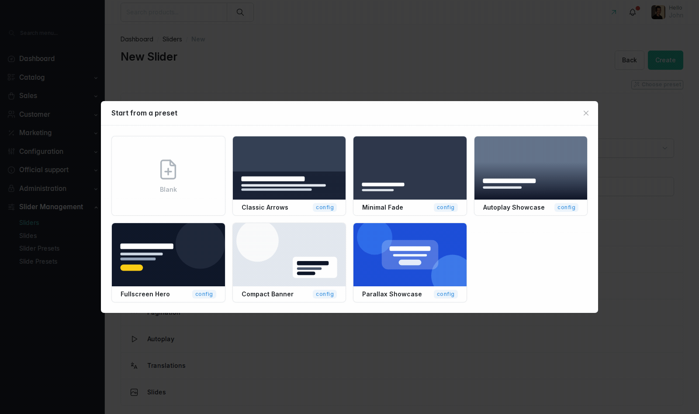

Storefront slider:


## Features

- **Editing workspace** — the slider/slide edit pages are a two-column
  workspace: the live preview is the main surface, settings live in a
  right-hand drawer (Save, language and breakpoint switcher always visible in
  its head); a fullscreen toggle expands the whole workspace.
- **Per-breakpoint everything** — Desktop / Mobile / Tablet each get their
  own image, optional video and layout settings; anything left empty falls
  back to Desktop, so nothing needs duplicating.
- **Per-locale overrides** — translations always override texts and can
  optionally override media and display settings via explicit checkboxes,
  in the same Desktop/Mobile/Tablet structure.
- **Slide edit modal from the grid** — the slides grid's row action opens a
  modal with the live preview and the real slide form in place, instead of
  navigating away; a header link still opens the full editor.
- **Slides browser & create modals** — the slider's Slides section lists
  attached slides with an **Add** browser (search, membership filter,
  pagination, pending-change badges, one **Save**) and a **Create** modal
  that runs the full slide-creation flow pre-attached to the slider.
- **Style presets** — one-click bundles for sliders and slides, from
  project config and/or admin-managed database presets (CRUD under *Slider
  Management → Style Presets*, with mockup thumbnails). A preset gallery
  opens on the slider/slide create pages; the preview toolbar's *Preset*
  dropdown previews on hover and applies on click.
- **Content animations** — nine entrance animation types
  (`fade-up`/`fade-down`/`fade-left`/`fade-right`/`zoom-in`/`slide-up`/
  `flip-in`/`blur-in`/`bounce-in`) with per-type duration/delay, starting
  when the slider scrolls into view and replaying on slide change.
- **Video slides** — self-hosted uploads or an external video URL
  (YouTube, normalized and embedded via a privacy-enhanced
  `youtube-nocookie` player); autoplay or a visitor play-button, with
  slider autoplay waiting for an auto-playing video to end before
  advancing. The provider architecture is extensible.
- **Autoplay, navigation & pagination** — autoplay with an optional
  progress bar, five transition effects, configurable arrow/pagination
  placement, style, size, shadow and color, keyboard navigation, touch
  swipe, parallax and lazy-loaded media.
- **Symfony UX storefront** — a `vanssa_sylius_slider:shop:slider` Twig
  Component (plus a homepage LiveComponent variant) and a `vanssa-slider`
  Stimulus controller; every admin-configured value is exposed as a CSS
  custom property or data attribute for theming.
- **Twig Hooks integration** for both the admin CRUD pages and — optionally
  — the shop homepage.
- **Demo fixtures** — a dedicated fixture suite with real bundled photos and
  video clips.

## Requirements

| Dependency | Version |
| --- | --- |
| PHP | `>= 8.3` |
| Sylius | `^2.1` |
| Symfony | `^7.4` |
| `symfony/ux-turbo` | `^2.22` |
| Node.js | `>= 20` (Yarn Classic v1) |

`composer.json` temporarily pins `api-platform/metadata`, `api-platform/symfony`,
`api-platform/doctrine-common` and `api-platform/doctrine-orm` below `4.3`
via a `conflict` block (a fresh install resolving api-platform `4.3.x`
breaks `cache:warmup` in Sylius's ApiBundle routing). Keep those
sub-packages below `4.3` in your project until this pin is lifted.

## Installation

### Option A — Symfony Flex endpoint (recommended)

The plugin serves its own Flex recipe endpoint from this repository, so
`composer require` can auto-register the bundle, config and routes:

```bash
composer config --json extra.symfony.endpoint '["https://raw.githubusercontent.com/vanssata/sylius-slider-plugin/2.3/flex/index.json","flex://defaults"]'
composer require vanssa/sylius-slider-plugin
```

This registers the bundle in `config/bundles.php`, imports the plugin
configuration and imports the admin (`/admin`-prefixed) and shop routes.
See [docs/FLEX_RECIPE.md](docs/FLEX_RECIPE.md) for how the endpoint resolves
and what exactly it writes. Continue with **Frontend setup** below.

### Option B — Manual backend wiring

```bash
composer require vanssa/sylius-slider-plugin
```

```php
// config/bundles.php
return [
    // ...
    Vanssa\SyliusSliderPlugin\VanssaSyliusSliderPlugin::class => ['all' => true],
];
```

```yaml
# config/packages/vanssa_sylius_slider.yaml
imports:
    - { resource: '@VanssaSyliusSliderPlugin/config/config.yaml' }
```

```yaml
# config/routes/vanssa_sylius_slider.yaml
vanssa_sylius_slider_admin:
    resource: '@VanssaSyliusSliderPlugin/config/routes/admin.yaml'
    prefix: /admin

vanssa_sylius_slider_shop:
    resource: '@VanssaSyliusSliderPlugin/config/routes/shop.yaml'
```

### Frontend setup (both options)

1. Run database migrations:

   ```bash
   bin/console doctrine:migrations:migrate -n
   ```

2. Add the plugin's frontend package as a `file:` dependency:

   ```bash
   yarn add @vanssa/sylius-slider-plugin@file:vendor/vanssa/sylius-slider-plugin/assets
   ```

3. Register the plugin's Stimulus controllers in your project's
   `assets/controllers.json`. The manifest ships inside the package
   (`vendor/vanssa/sylius-slider-plugin/assets/package.json`); in **your**
   Sylius-Standard project (a single Stimulus application) enable every
   entry with `"enabled": true`:

   ```json
   {
     "controllers": {
       "@vanssa/sylius-slider-plugin": {
         "slider": {
           "enabled": true,
           "fetch": "eager",
           "autoimport": {
             "@vanssa/sylius-slider-plugin/shop/styles/slider.scss": true
           }
         },
         "slider-settings": { "enabled": true, "fetch": "eager" },
         "slider-slides-preview": { "enabled": true, "fetch": "eager" },
         "rgba-color-picker": {
           "enabled": true,
           "fetch": "eager",
           "autoimport": {
             "@simonwep/pickr/dist/themes/classic.min.css": true
           }
         },
         "responsive-copy": { "enabled": true, "fetch": "eager" },
         "preview-frame": { "enabled": true, "fetch": "eager" },
         "preset-applier": { "enabled": true, "fetch": "eager" },
         "preset-gallery": { "enabled": true, "fetch": "eager" },
         "form-context": { "enabled": true, "fetch": "eager" },
         "animation-settings": { "enabled": true, "fetch": "eager" },
         "mockup-picker": { "enabled": true, "fetch": "eager" },
         "modal-portal": { "enabled": true, "fetch": "eager" },
         "slide-video": { "enabled": true, "fetch": "eager" }
       }
     },
     "entrypoints": []
   }
   ```

   > **Why `enabled: true` here, unlike this repository's own
   > `assets/controllers.json`:** this plugin's own test application merges
   > its manifest into **two** Encore entries that both start a Stimulus
   > application, so its own manifest deliberately ships `enabled: false`
   > and registers controllers explicitly in code instead. A normal
   > Sylius-Standard project has a single admin/shop Stimulus application,
   > so the standard manifest-driven `enabled: true` registration (as above)
   > is exactly right and each controller runs once.

   Keep your project's existing controller entries (e.g.
   `@symfony/ux-live-component`, `@symfony/ux-autocomplete`) — only add the
   `@vanssa/sylius-slider-plugin` block.

4. Build assets:

   ```bash
   yarn install
   yarn build
   bin/console assets:install
   bin/console cache:clear
   ```

   If you change the plugin's assets or `assets/package.json` later and a
   rebuild doesn't pick up the change, Yarn Classic copies (rather than
   symlinks) `file:` dependencies — re-run `yarn install --force` before
   `yarn build`.

5. *(Optional)* Load the demo fixtures:

   ```bash
   bin/console sylius:fixtures:load --suite=vanssa_sylius_slider_demo -n
   ```

   This creates three sliders (shared and non-shared slides) with real
   photo covers (desktop + mobile variants) and video slides, using media
   bundled under `assets/fixtures/` (`assets/fixtures/LICENSE.md` has
   attribution).

6. *(Optional)* Render a slider on the shop homepage via Twig Hooks:

   ```yaml
   # config/packages/vanssa_sylius_slider.yaml
   sylius_twig_hooks:
       hooks:
           'sylius_shop.homepage.index':
               banner:
                   enabled: false
               vanssa_sylius_slider_homepage:
                   component: 'vanssa_sylius_slider:shop:homepage_slider'
                   props:
                       code: 'homepage-main'
                   priority: 400
   ```

   `sylius_shop.homepage.index` is Sylius core's own homepage hookable; the
   plugin ships no shop-side hooks of its own, so this wiring lives in your
   project config.

## Configuration

The plugin's own defaults live in `config/config.yaml` (imported per the
installation steps above); every key can be overridden per-project under
`vanssa_sylius_slider` in your own config.

### Presets (form choices & defaults)

`vanssa_sylius_slider.presets` supplies the `values`/`default` pair behind
every choice-typed field in the admin forms:

- `presets.slider.<name>` — `container_width`, `spacing`, `slide_effect`,
  `navigation_icon`, `navigation_size`, `navigation_shadow`,
  `arrows_position`, `arrows_vertical_align`, `pagination_position`,
  `pagination_style`, `pagination_shape`, `pagination_size`,
  `pagination_shadow`, `autoplay_interval`, `parallax_strength` (unset by
  default — parallax stays disabled until a strength is chosen).
- `presets.slide.<name>` — `headline_element`, `content_horizontal_position`,
  `content_vertical_position`, `content_text_align`, `content_animation`,
  `animation_duration`, `animation_delay`, `background_blur_preset`,
  `content_blur_strength`, `content_padding`, `content_margin`,
  `border_radius`, `headline_font_size`, `description_font_size`,
  `button_font_size`, `linking_type`, `button_appearance`, `button_size`,
  `button_position`.
- `presets.color_switcher.theme` / `.default_representation` /
  `.swatches.<text|neutral|accent>` — defaults for every
  `ColorPickerType` field (Pickr theme/representation and swatch lists).

### Slider options reference

All options live on the slider (Admin → Sliders → edit → Settings), stored
in the settings JSON:

| Option | Values | Default | Description |
| --- | --- | --- | --- |
| `arrowsPosition` | `overlay`, `outside`, `bottom` | `overlay` | Placement of the prev/next arrows |
| `arrowsVerticalAlign` | `center`, `top`, `bottom` | `center` | Vertical alignment of overlay arrows |
| `paginationPosition` | `bottom-inside`, `bottom-outside`, `top`, `left`, `right` | `bottom-inside` | Placement of the pagination indicators |
| `paginationStyle` | `dots`, `lines`, `numbers` | `dots` | Indicator style |
| `keyboardNavigation` | bool | `true` | Left/right arrow keys switch slides |
| `touchSwipe` | bool | `true` | Swipe gestures on touch devices |
| `showProgressBar` | bool | `false` | Autoplay progress bar (requires autoplay; respects reduced motion) |
| `lazyLoadMedia` | bool | `true` | `loading="lazy"` / `preload="none"` for non-first slides |

Additionally: effects (`slide`/`fade`/`zoom`/`lift`/`flip`), speed, rewind,
autoplay (`enabled`/`interval`/`pauseOnHover`), parallax strength, arrow
icon/size/colors/shadow, and pagination shape/size/colors/shadow. Content
blur is configured **per slide and breakpoint** (Slide → Media & Settings →
Effects: `backgroundBlurPreset`, `enableTextBlur`, `contentBlurStrength`).

Slide media and layout are organized **per breakpoint** (Desktop / Mobile /
Tablet): each has its own image, optional video (replaces the image when
set) and layout settings including the heading tag. Empty Mobile/Tablet
values fall back to Desktop.

### Slide videos

Each video slot accepts a **self-hosted upload** or an **external video
URL** — currently YouTube (any watch/short/embed link; normalized and
stored as a canonical URL, rendered as a privacy-enhanced
`youtube-nocookie` embed). The URL wins over the upload for its slot;
clearing it removes the external video. Video playback (Media & Settings,
slide-global) is either *Start automatically* or a *Play button*; slider
autoplay advances on the video's `ended` event instead of the fixed
interval when the active slide is auto-playing a video. See
[docs/EXTENDING.md](docs/EXTENDING.md) to add another provider
(implement `VideoProviderInterface`, tag
`vanssa_sylius_slider.video_provider`).

### Admin preview entrypoints

The admin preview turbo-frame includes your storefront Webpack Encore
entrypoints so it renders styled like the real shop. Configure them if your
project uses different build/entry names (format `"build:entry"` or
`"entry"`):

```yaml
vanssa_sylius_slider:
    preview:
        shop_entrypoints:
            - 'shop:shop-entry'
            - 'app.shop:app-shop-entry'
            - 'app.shop:plugin-shop-entry'
```

### Style presets

Style presets are one-click style bundles for sliders and slides, merged
from two sources everywhere presets are offered:

1. **Configuration presets** — `vanssa_sylius_slider.style_presets.<slide|slider>`
   (read-only in the admin, labeled *config*).
2. **Database presets** — created under *Slider Management → Style
   Presets* (labeled *custom*). A database preset with the same `code`
   **overrides** the configuration one.

Presets appear in the preview panels' *Preset* dropdown (hover previews,
click applies — nothing persists until the form is saved) and in the
preset gallery modal that opens on the slider/slide *create* pages
(**Blank** or a preset card; database slider presets with source slides
create the slider server-side at `/admin/sliders/new/from-preset/{code}`,
**cloning** the slides into independent copies).

Each configuration preset is a `label` plus a flat map of **dot-paths**
(relative to the form root) to scalar values:

```yaml
# config/packages/vanssa_sylius_slider.yaml
vanssa_sylius_slider:
    style_presets:
        slide:
            brand_hero:
                label: 'Brand Hero'
                settings:
                    settings.responsive.desktop.headlineColor: 'rgba(250, 204, 21, 1)'
                    settings.responsive.desktop.backgroundColor: 'rgba(15, 23, 42, 0.75)'
                    settings.responsive.desktop.contentAnimation: 'fade-up'
                    settings.responsive.desktop.animationDuration: 700
                    settings.linking.buttonAppearance: 'primary'
        slider:
            brand_carousel:
                label: 'Brand Carousel'
                settings:
                    settings.slideEffect: 'fade'
                    settings.speed: 700
                    settings.autoplay.enabled: true
                    settings.autoplay.interval: 6000
                    settings.parallax.strength: '1rem'
```

Valid dot-path groups:

- **Slide presets** — `settings.responsive.<desktop|tablet|mobile>.<field>`
  (texts & typography: `title`, `description`, `headlineElement`,
  `headlineFontSize`, `descriptionFontSize`, `buttonFontSize`; layout:
  `contentHorizontalPosition`, `contentVerticalPosition`,
  `contentTextAlign`, `contentPadding`, `contentMargin`, `contentWidth`
  (`boxed` reading width or `full` edge-to-edge strip), `contentMaxHeight`
  (up to `20%`–`50%` of the slide height), `borderRadius`,
  `customCssClass`; colors: `textColor`, `headlineColor`,
  `descriptionColor`, `backgroundColor`, `mediaOverlayColor`; effects:
  `contentAnimation`, `animationDuration`, `animationDelay`,
  `backgroundBlurPreset`, `enableTextBlur`, `contentBlurStrength`;
  visibility: `hideTitle`, `hideDescription`, `hideButton`), plus
  `settings.linking.<field>` (`type`, `buttonAppearance`, `buttonSize`,
  `buttonPosition`, `overlay`, `openExternal`, `showProductFocusImage`).
- **Slider presets** — `settings.<field>` for any slider settings field
  (see the reference above), nested as
  `settings.autoplay.<enabled|interval|pauseOnHover>` and
  `settings.parallax.strength`.

The plugin ships slide presets `hero_dark`, `clean_light`, `minimal`,
`bold_center`, `split_left_light`, `gradient_overlay`, `glass_card`,
`bottom_banner`, `promo_badge_right`, and slider presets `classic_arrows`,
`minimal_fade`, `autoplay_showcase`, `fullscreen_hero`, `compact_banner`,
`parallax_showcase`. Override any of them in your project config by
reusing the same code.

### Twig Components & templates

Shop rendering:

```twig
{{ component('vanssa_sylius_slider:shop:slider', {
    slider: slider,
    localeCode: app.request.locale,
    fallbackLocaleCode: sylius.channel.defaultLocale.code|default(null)
}) }}
```

or, for the homepage LiveComponent variant:

```twig
{{ component('vanssa_sylius_slider:shop:homepage_slider', { code: 'homepage-main' }) }}
```

The admin CRUD pages (create/update, for `slider`, `slide` and
`style_preset`) are composed through Twig Hooks under
`sylius_admin.<resource>.<create|update>.content...` — see
`config/twig_hooks/admin/*.yaml` and [docs/EXTENDING.md](docs/EXTENDING.md)
for the hook tree and how to override a section template.

### Reusable color picker field

`Vanssa\SyliusSliderPlugin\Form\Type\ColorPickerType` can be used on any
form field:

```php
$builder->add('headlineColor', ColorPickerType::class, [
    'required' => false,
    'picker_theme' => 'classic',
    'picker_swatches' => ['rgba(250, 204, 21, 1)', 'rgba(17, 24, 39, 0.85)'],
    'picker_predefined_only' => false,
]);
```

See [docs/COLOR_PICKER_TYPE.md](docs/COLOR_PICKER_TYPE.md) for the full
option reference (`picker_theme`, `picker_swatches`,
`picker_default_representation`, `picker_predefined_only`,
`picker_options`, `picker_button_label`, `picker_placeholder`).

### CSS & JS variables

Every admin-configured value is exposed on the storefront:

- **CSS custom properties** — `--vanssa-slider-*` on
  `<section class="vanssa-slider">` and `--vanssa-slide-*` on
  `.vanssa-slide__content` per breakpoint.
- **Data attributes** on the slide root for non-visual values
  (`data-vanssa-headline-element`, `data-vanssa-animation`,
  `data-vanssa-button-position/-appearance/-size`,
  `data-vanssa-parallax-strength`).
- **SCSS build-time defaults** — `$vanssa-slider-*` / `$vanssa-slide-*`
  `!default` variables in `assets/styles/_tokens.scss` (e.g.
  `$vanssa-slider-speed`, `$vanssa-slider-nav-color`,
  `$vanssa-slide-content-padding`, `$vanssa-content-animations`); override
  them before importing the plugin SCSS to retheme without touching the
  admin.
- **JS** — the `vanssa-slider` Stimulus controller receives behavioral
  settings in its `options` value and exposes `cssVar(name)`.

## Admin Usage

After installation, manage sliders and slides in the admin:

- `Sliders`: `/admin/sliders`
- `Slides`: `/admin/slides`
- `Style Presets`: `/admin/style-presets`

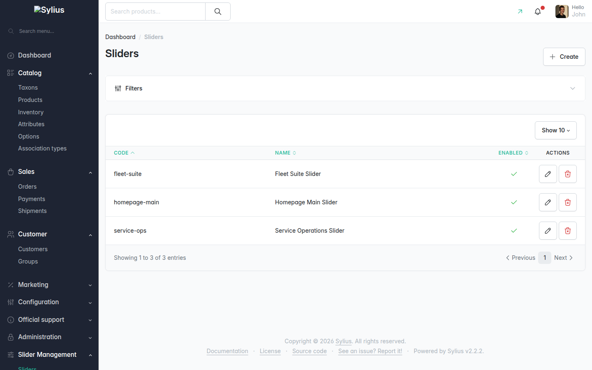

Typical flow: create slides, create a slider, assign/reorder slides on the
slider edit page, then render the slider in the storefront by code.

### Slider editing workspace

The live preview is the main surface; the settings drawer opens from the
toolbar (Save, language and breakpoint switcher always visible):

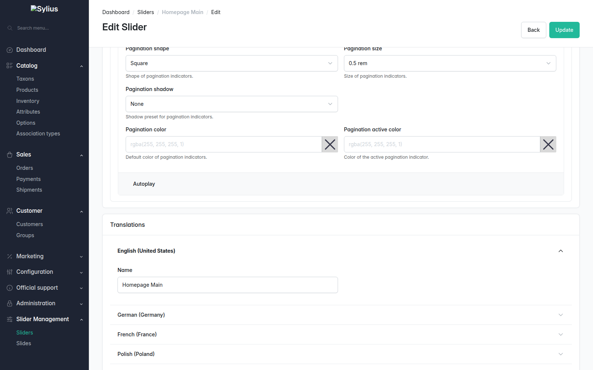

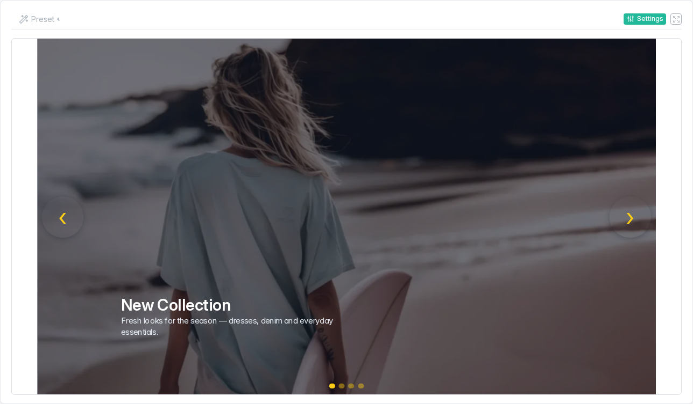

The **Slides** section lists attached slides with preview/edit/detach
actions; **Add** opens a browser over every admin slide (search,
membership filter, pagination — checking rows marks pending changes,
**Save changes** commits them all); **Create** runs the full slide-creation
flow in a modal, pre-attached to the slider:

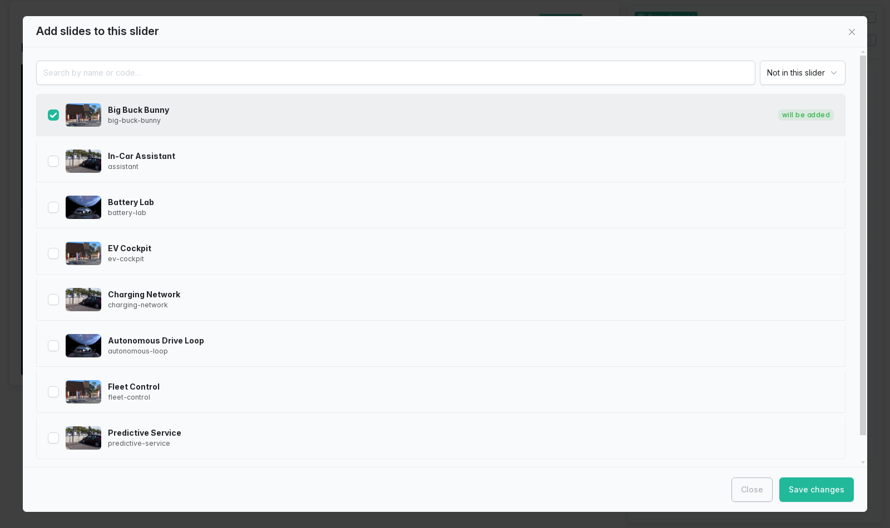

### Slide editing

The "Media & Settings" card groups everything per breakpoint — each of the
Desktop / Mobile / Tablet tabs carries its own cover image, optional video
and layout settings:

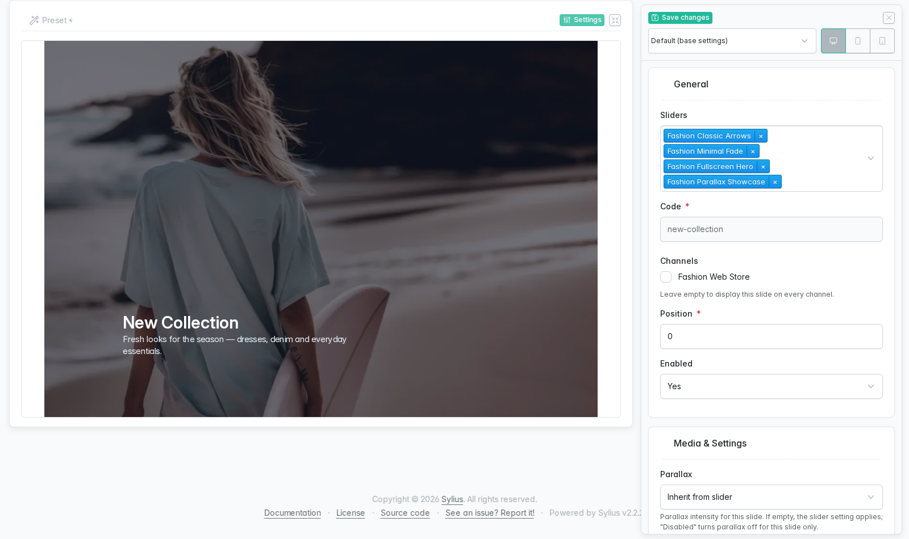


The slides grid's row action opens the same edit form and live preview in
a modal, without leaving the grid:

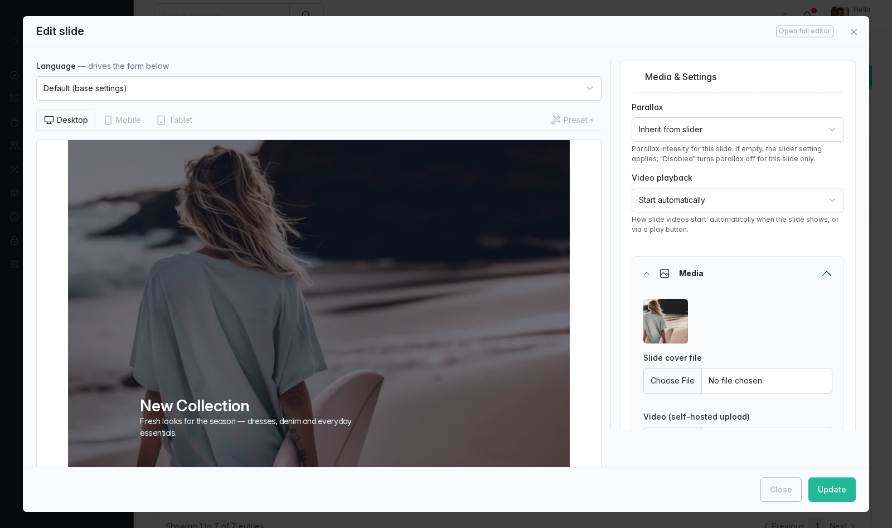

> The screenshot above (`admin-slide-edit-modal.png`) is a placeholder —
> capture is pending; see [docs/SCREENSHOTS.md](docs/SCREENSHOTS.md).

### Slide translations

Each locale follows the same Desktop/Mobile/Tablet structure — texts are
always applied for the locale, while media and display settings are only
overridden after enabling the corresponding checkbox:

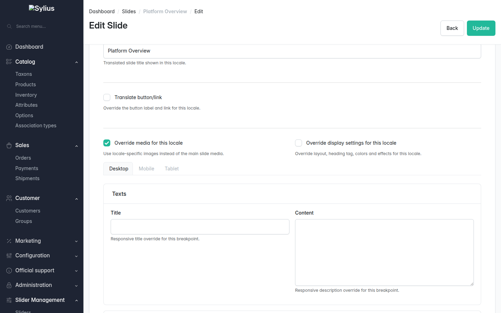

### Style presets & creation gallery

*Slider Management → Style Presets* provides full CRUD (code, type,
label, mockup image, dot-path settings JSON, and — for slider presets —
source slides to clone):

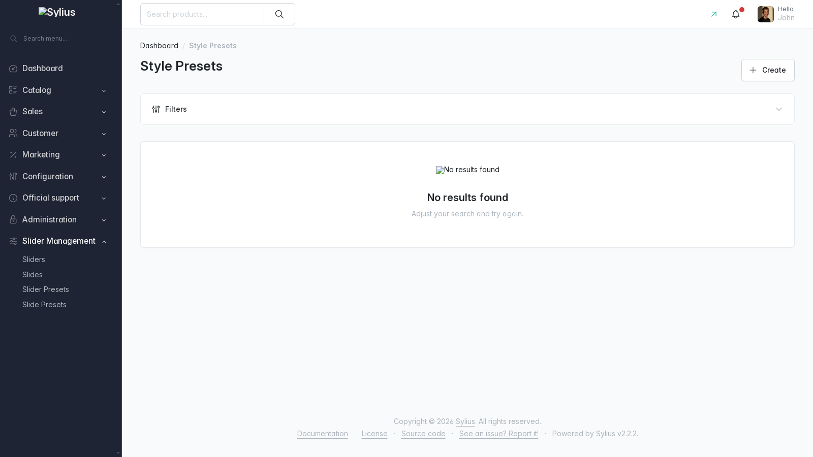

Creating a slider or slide opens a preset gallery first:

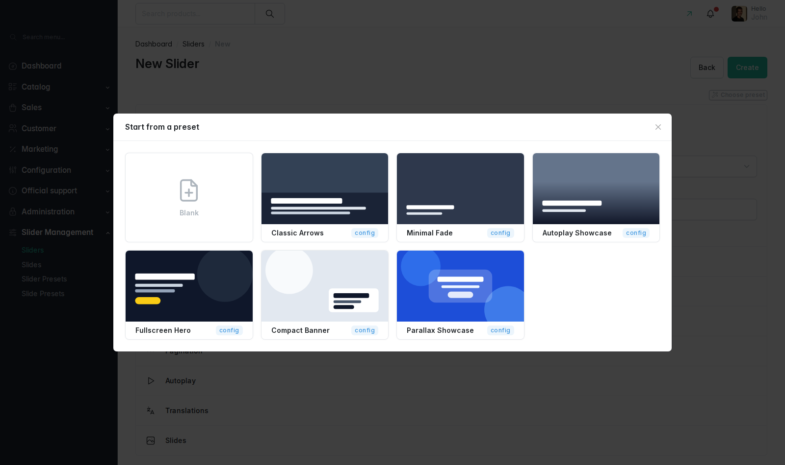

## Storefront Usage

Content animations start when the slider scrolls into view and replay on
slide changes; slide videos play only while their slide is visible. Each
breakpoint renders its own media (video wins over image, desktop fallback).

| Desktop | Mobile |
| --- | --- |
| 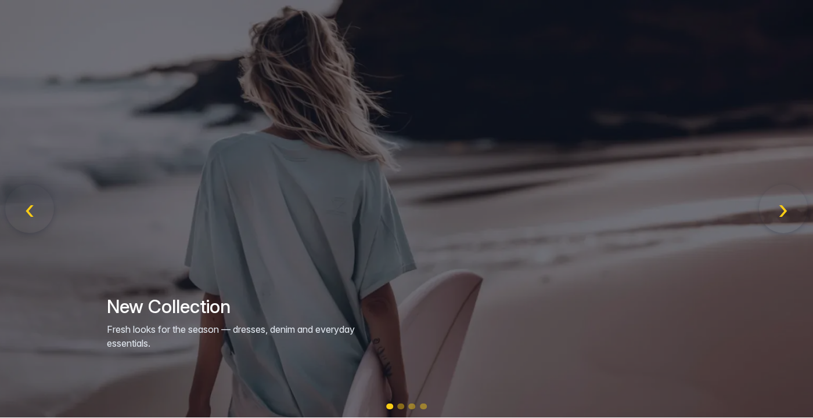 | 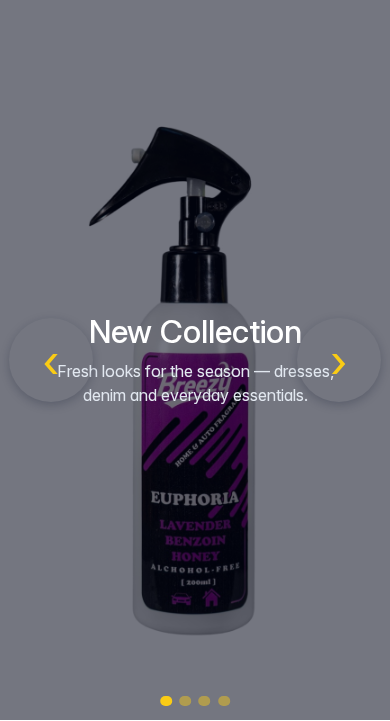 |

### Routes

- Full slider page: `/slider/{code}`
- Banner-like single slide page: `/banner/{code}`

### Optional integrations

- **Sylius CMS Plugin** — render a slider inside a CMS block via
  `@VanssaSyliusSliderPlugin/shop/integration/cms/slider_block.html.twig`:

  ```twig
  {{ sylius_cms_render_block('homepage_slider', '@VanssaSyliusSliderPlugin/shop/integration/cms/slider_block.html.twig', {'slider_code': 'homepage-main'}) }}
  ```

- **Monsieur Biz Rich Editor Plugin** — when installed, slide description
  content is rendered through its filter on the storefront automatically
  (no configuration needed); the admin description field itself stays a
  plain textarea.

## Upgrading

```bash
composer update vanssa/sylius-slider-plugin
bin/console doctrine:migrations:migrate -n
```

Re-run the frontend build steps (`yarn install`, `yarn build`,
`assets:install`) after updating, and check `CHANGELOG.md` for any new
config keys, migrations or controller manifest changes.

## Documentation & Contributing

- [Color Picker Type](docs/COLOR_PICKER_TYPE.md)
- [Flex Recipe](docs/FLEX_RECIPE.md)
- [Extending](docs/EXTENDING.md)
- [Screenshots](docs/SCREENSHOTS.md)
- [Changelog](CHANGELOG.md)

Want to work on the plugin itself (local setup, running the test suite,
Docker environment, releasing)? See
[docs/CONTRIBUTING.md](docs/CONTRIBUTING.md).
