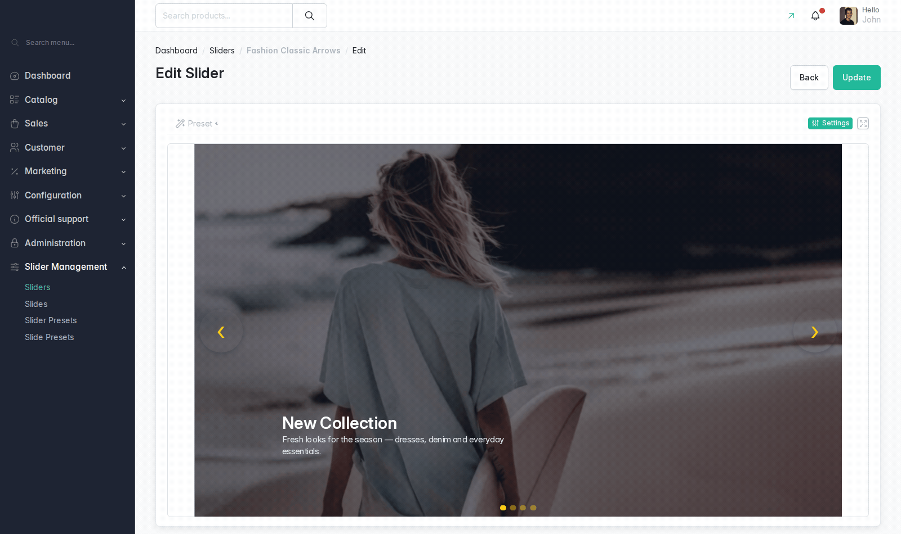
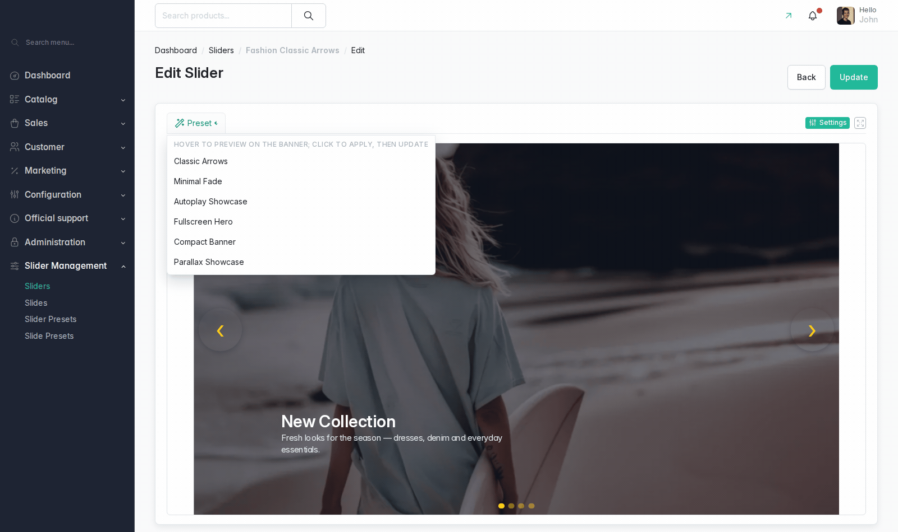

# Vanssa Sylius Slider Plugin

A Sylius 2.x plugin for building and managing rich storefront sliders and
banners: a two-column admin workspace with a live preview, per-breakpoint
media and layout, per-locale overrides, one-click style presets, content
animations and video slides (self-hosted or YouTube) — rendered on the
storefront through Symfony UX (Stimulus + Twig Components) and Twig Hooks.

[](https://github.com/vanssata/sylius-slider-plugin/actions/workflows/build.yaml)
[](https://packagist.org/packages/vanssa/sylius-slider-plugin)
[](https://packagist.org/packages/vanssa/sylius-slider-plugin)
[](LICENSE)

## Feature tour

Editing workspace — live preview with the settings drawer (toolbar-driven
breakpoints and languages, live draft refresh):



Style preset try-on — hovering a preset in the toolbar previews it on the
actual banner, click applies it:



Storefront slider, and the same slide re-laid-out per breakpoint:

| Storefront | Breakpoints |
| --- | --- |
|  |  |

## What it does

- **Editing workspace** — the live preview is the main surface; settings live
  in a right-hand drawer with Save, language and breakpoint always visible.
- **Per-breakpoint everything** — Desktop / Tablet / Mobile each get their own
  image, optional video and layout settings; anything left empty falls back to
  the wider breakpoint.
- **Per-locale overrides** — translations always override texts and can
  optionally override media and display settings.
- **Slide edit modal** — edit a slide from the grid without leaving it.
- **Style presets** — one-click bundles for sliders and slides, from project
  config and/or admin-managed database presets, with a gallery on the create
  pages and hover try-on in the toolbar.
- **Content animations** — nine entrance types with per-type duration/delay,
  triggered when the slider scrolls into view.
- **Video slides** — self-hosted uploads or an external URL (YouTube via the
  privacy-enhanced `youtube-nocookie` player); the provider layer is extensible.
- **Autoplay, navigation and pagination** — progress bar, five transition
  effects, configurable arrow/pagination placement and styling, keyboard
  navigation, touch swipe, parallax, lazy-loaded media.
- **Symfony UX storefront** — Twig Components plus a `vanssa-slider` Stimulus
  controller; every admin-configured value is exposed as a CSS custom property
  or data attribute for theming.
- **Twig Hooks integration** for the admin CRUD pages and, optionally, the shop
  homepage.
- **Demo fixtures** — a dedicated suite with bundled photos and a video clip.

Full option-by-option reference: [docs/usage/options-reference.md](docs/usage/options-reference.md).

## Requirements

| Dependency | Version |
| --- | --- |
| PHP | `>= 8.3` |
| Sylius | `^2.1` |
| Symfony | `^7.4` |
| `symfony/ux-turbo` | `^2.22` |
| Node.js | `>= 20` (Yarn Classic v1) |

The frontend requires an Encore + `@symfony/stimulus-bridge` build (the
Sylius-Standard default). **AssetMapper is not supported** — the plugin ships
no importmap entries.

`composer.json` temporarily pins `api-platform/metadata`,
`api-platform/symfony`, `api-platform/doctrine-common` and
`api-platform/doctrine-orm` below `4.3` via a `conflict` block: a fresh install
resolving api-platform `4.3.x` breaks `cache:warmup` in Sylius's ApiBundle
routing. Keep those sub-packages below `4.3` in your project until the pin is
lifted.

## Install

```bash
composer config --json extra.symfony.endpoint '["https://raw.githubusercontent.com/vanssata/sylius-slider-plugin/2.3/flex/index.json","flex://defaults"]'
composer require vanssa/sylius-slider-plugin -W
bin/console doctrine:migrations:migrate -n
yarn install --force && yarn build && bin/console assets:install
```

`--force` matters on the first install too: Yarn Classic *copies* `file:`
dependencies into `node_modules` instead of symlinking them, so a plain
`yarn install` can leave a stale copy of the plugin's assets in place.

The Flex recipe registers the bundle, imports the config, mounts the admin
and shop routes, and patches the storefront pair into your
`assets/shop/controllers.json` and the full 14-controller set into your
`assets/admin/controllers.json`. Separately, core Flex's
`PackageJsonSynchronizer` seeds your root `assets/controllers.json` with all
14 controllers, but only the storefront pair active — the per-context files
above take precedence in both builds. Manual wiring, the frontend contract
and the optional Twig Hooks homepage integration are in
[docs/usage/getting-started.md](docs/usage/getting-started.md);
[docs/FLEX_RECIPE.md](docs/FLEX_RECIPE.md) explains what the endpoint resolves
and writes.

## Documentation

**Using the plugin**

- [Getting started](docs/usage/getting-started.md) — install, first slider, demo fixtures
- [Admin guide](docs/usage/admin-guide.md) — the editing workspace, section by section
- [Style presets](docs/usage/style-presets.md) — gallery, try-on, admin-managed vs config
- [Storefront](docs/usage/storefront.md) — routes, hooks, breakpoints, video slides
- [Options reference](docs/usage/options-reference.md) — every option, value and default

**Extending the plugin**

- [Architecture](docs/dev/architecture.md) — layers and where things live
- [Adding a Stimulus controller](docs/dev/adding-a-stimulus-controller.md) — the four manifests
- [Extending](docs/dev/extending.md) — templates, services, form fields, providers
- [Style presets](docs/dev/style-presets.md) — defining presets in config
- [Color picker type](docs/dev/color-picker-type.md) — the reusable RGBA field
- [Testing](docs/dev/testing.md) — PHPUnit, Behat, Playwright and when to use which
- [Docs media](docs/dev/docs-media.md) — regenerating the screenshots and GIFs
- [Contributing](docs/dev/contributing.md) — local setup and release flow
- [Flex recipe](docs/FLEX_RECIPE.md) — how the recipe endpoint works

[Changelog](CHANGELOG.md) · [Upgrade guide](UPGRADE.md)

## Upgrading

```bash
composer update vanssa/sylius-slider-plugin
composer recipes:update vanssa/sylius-slider-plugin
bin/console doctrine:migrations:migrate -n
yarn install --force && yarn build && bin/console assets:install
```

`composer recipes:update` re-applies the Flex recipe's patches — this is what
picks up a changed recipe `ref`, such as the controller-manifest split added
in 2.3.2. Yarn Classic *copies* `file:` dependencies instead of symlinking
them, so `yarn install --force` is not optional after an upgrade — a plain
install can keep serving a stale copy of the plugin's assets. Check
[CHANGELOG.md](CHANGELOG.md) for new config keys, migrations or controller
manifest changes; see [UPGRADE.md](UPGRADE.md) for the 2.3.2 controller-split
migration specifically.

## License

MIT — see [LICENSE](LICENSE). The Sylius trademark and logo are covered by
[LICENSE_OF_TRADEMARK_AND_LOGO](LICENSE_OF_TRADEMARK_AND_LOGO).
