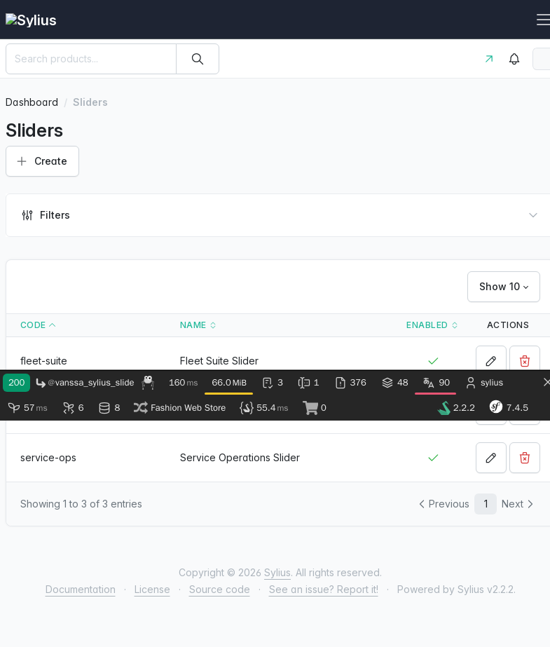
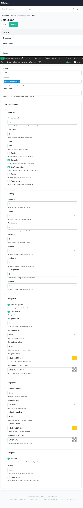

# Screenshots

This document shows plugin setup and usage screens from:

- Sylius Admin (slider management)
- Storefront (rendered slider page)

Screenshots were generated with Chromium in Docker (`chrome` service from `compose.override.yml`) after loading demo fixtures:

```bash
docker compose exec -T php sh -lc "vendor/bin/console sylius:fixtures:load vanssa_sylius_slider_demo -n"
```

## Admin: Sliders list

Path: `/admin/sliders`



## Admin: Slider edit (setup)

Path: `/admin/sliders/1/edit` (fixture slider: `homepage-main`)



## Frontend: Slider usage

Path: `/slider/homepage-main`


