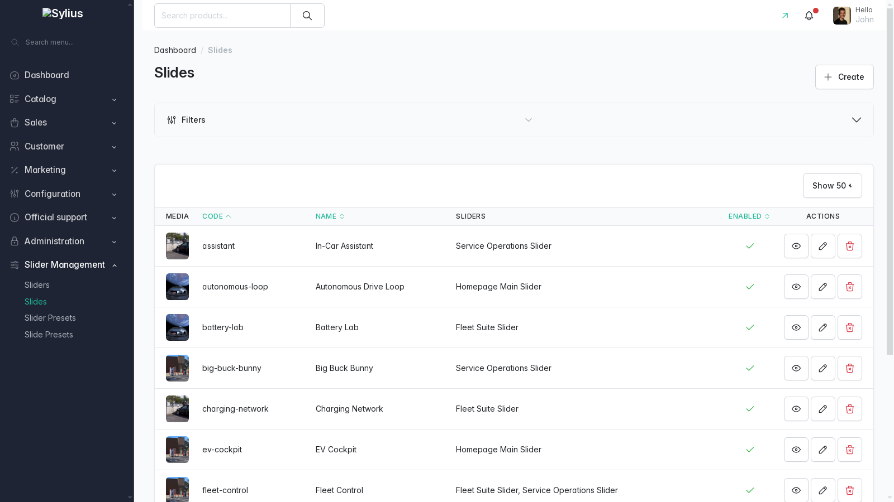
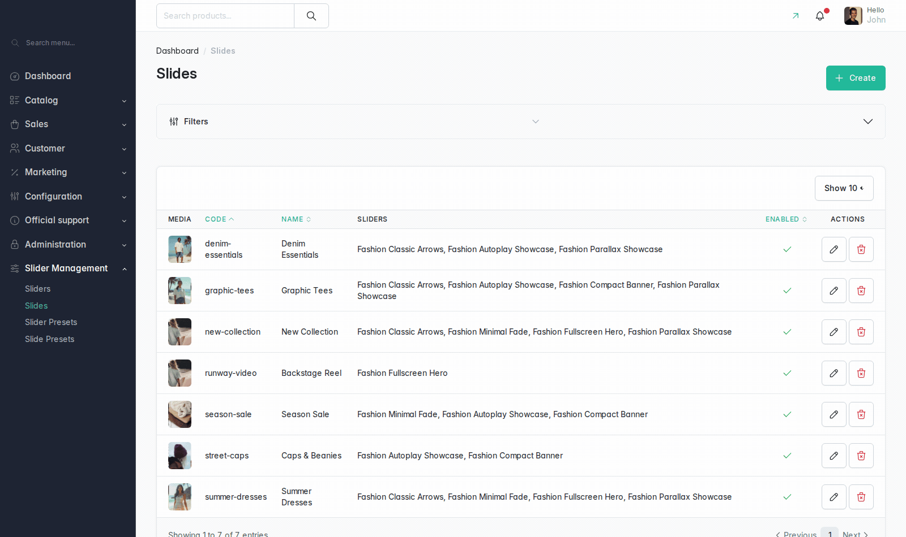
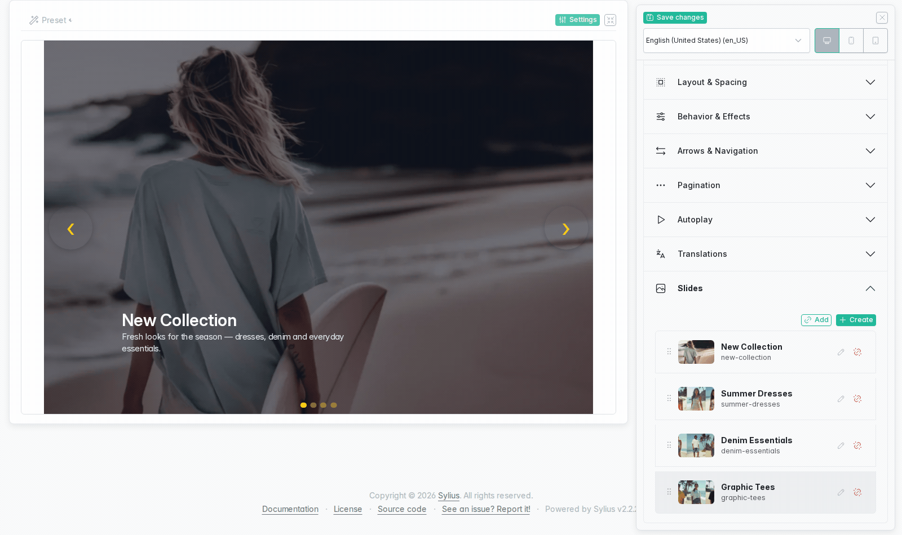

# Admin guide

This is a walkthrough of every screen the plugin adds to the Sylius admin:
the two grids, the slider editing workspace, the settings accordion, the
slide edit modal, the per-breakpoint media form, the per-locale
translations, and the browser that attaches slides to a slider.

## Where the plugin lives in the admin

The plugin adds one top-level group to the admin sidebar, **Slider
Management**, with four entries:

| Menu entry | Path |
| --- | --- |
| Sliders | `/admin/sliders/` |
| Slides | `/admin/slides/` |
| Slider Presets | `/admin/style-presets/` filtered to `type=slider` |
| Slide Presets | `/admin/style-presets/` filtered to `type=slide` |

Both preset entries open the same Style Presets grid; they only differ in
the `criteria[type]` they pass.

If you want the screens below filled with data, load the demo fixture
suite. The host runs nothing directly — everything goes through the
containers:

```bash
make load-slider-fixtures
```

which is `docker compose run --rm php vendor/bin/console
sylius:fixtures:load vanssa_sylius_slider_demo -n`. That suite creates six
sliders (`fashion-classic-arrows`, `fashion-minimal-fade`,
`fashion-autoplay-showcase`, `fashion-fullscreen-hero`,
`fashion-compact-banner`, `fashion-parallax-showcase`) sharing a pool of
seven slides (`new-collection`, `summer-dresses`, `denim-essentials`,
`graphic-tees`, `street-caps`, `season-sale`, `runway-video`).

The screenshots on this page were captured against a different data set, so
the slider and slide names in them will not match the demo fixtures. The
screens themselves are the ones you get.

## The sliders grid

Path: `/admin/sliders/`


Columns, left to right:

- **Code** — the identifier you render the slider by on the storefront.
  Sortable, and the default sort (ascending).
- **Name** — the slider's translated name. Sortable.
- **Slides** — a badge with the number of attached slides. It counts every
  attachment, including disabled slides, so a slider showing `4` can still
  render fewer than four slides on the storefront.
- **Enabled** — a check or a cross.

The filter panel above the table filters on Code (substring), Name
(substring) and Enabled (yes/no).

Row actions, in order:

- **Eye** — opens a read-only preview modal titled *Preview*. It has a
  language select and Desktop / Mobile / Tablet buttons, and renders the
  slider as it is currently **saved**; there is no form in it.
- **Pencil** — opens the editing workspace described below.
- **Trash** — deletes the slider. Slides attached to it are not deleted;
  they lose that membership.

**Create** in the page header opens the regular create form. On a create
page there is no live preview and no settings drawer — the form renders as
one stacked page, and the Slides section only says *Save slider first to
preview related slides*. The workspace appears after the first save.

## The slides grid

Path: `/admin/slides/`



Columns:

- **Media** — a 64×48 thumbnail of the slide's desktop cover image. If the
  slide has no desktop image but does have a desktop video, you get a blue
  `Video` badge instead. If it has neither, you get an empty grey box.
- **Code** — sortable, default sort ascending.
- **Name** — sortable.
- **Sliders** — the names of every slider the slide is attached to, joined
  by commas, or `-` when it is attached to none. A slide with `-` here is
  not reachable on the storefront through any slider.
- **Enabled** — a check or a cross.

Filters: Code, Name, Enabled.

Row actions:

- **Pencil** — does *not* navigate. It opens the
  [slide edit modal](#editing-a-slide-from-the-slides-grid) over the grid.
- **Trash** — deletes the slide everywhere.

**Create** does not go straight to the create form either: it opens the
preset gallery in choose mode, where you pick *Blank* or a preset card, and
only then land on the create page (a preset adds `?preset=<code>` to the
URL, which the create page applies to the form).

## The editing workspace

Opening a saved slider or slide for editing gives you a two-column
workspace instead of a plain form: the live preview is the main surface and
the settings live in a drawer.


With the drawer closed, the whole page is the preview plus its toolbar:


### The preview toolbar

The toolbar sits above the preview frame:

- **Preset** (left) — a dropdown of the style presets available for this
  resource type. It is only rendered when at least one preset exists.
  Hovering or keyboard-focusing an entry renders that preset in the preview
  after a short delay, without touching the form or your unsaved draft;
  moving away restores the previous render. Clicking an entry fills the
  actual form fields — those changes are still unsaved until you save.
- **Settings** (right) — opens the settings drawer.
- **Fullscreen** (far right, the diagonal-arrows icon) — expands the
  workspace.

### The settings drawer

The drawer is hidden by default. It is fixed to the right edge of the
viewport (460 px wide), so it never scrolls away; only its body scrolls.

Its head always shows three things, whatever you have scrolled to:

- **Save changes** — submits the edit form. This button lives outside the
  `<form>` element and is wired to it by id, which is why it can sit in the
  drawer head at all.
- **Language** — a select of the store's locales. On a slider page it
  preselects the locale you are browsing the admin in. On a slide page it
  additionally offers **Default (base settings)**, which shows the slide's
  untranslated base fields and previews them with every translation
  ignored.
- **Breakpoint** — three icon buttons: Desktop (preview at the panel's full
  width), Mobile (390 px) and Tablet (768 px).

The language and breakpoint controls do double duty: they change what the
preview renders **and** which parts of the form are visible. Selecting
Tablet, for example, hides the desktop fields of every settings section and
shows that section's tablet override fields instead. Nothing is disabled or
removed from the form — the full form is always submitted — so a hidden
field still keeps its stored value.


### Fullscreen

The Settings button and the fullscreen button toggle the same state:
opening the settings takes the workspace fullscreen, and going fullscreen
brings the settings up. `Escape` leaves it.

Fullscreen hides the admin navbar, the sidebar and the page header. That
means the page header's own **Update** button is not reachable while
fullscreen — use **Save changes** in the drawer head.

### How the live preview stays in sync

The preview is a Turbo frame that renders the real storefront markup inside
the admin page, so it is styled by your shop's build, not by the admin's.

Unsaved edits do not exist on the server yet, so the plugin snapshots the
whole form into `localStorage` as a draft and reloads the frame with it
about half a second after you stop typing. While that is pending, a
spinner overlay covers the preview.

Two consequences worth knowing:

- The draft is cleared when the edit page loads, so a session you abandoned
  earlier cannot leak into a later render.
- A draft is not a save. If you navigate away without saving, the edits are
  gone even though the preview was showing them.

## The slider settings accordion

Everything in the slider drawer is one flat accordion — only one section is
open at a time, and opening one closes the previous one. The sections, in
order:

### General

Open by default.

- **Code** — required, at most 64 characters, and restricted to letters,
  digits, dashes and underscores starting with a letter or digit. The field
  is **disabled once the slider has been saved**: pick the code you intend
  to render by, because you cannot change it later from this form.
- **Enabled** — a Yes/No select.
- **Channels** — a checkbox per channel. Leaving every box unchecked means
  *every* channel. Checking a subset restricts the slider to those
  channels, so a slider that ticks only a staging channel will not render
  on your live one.
- **Css classes** — extra classes for the slider root element. Only
  letters, digits, spaces, dashes and underscores are accepted.

### Layout & Spacing

- **Container width** — `Content` or `Full`.
- **Max height** — a free CSS length such as `560px`, `70vh` or `48rem`.
  Anything else is rejected with *Enter a valid CSS size*.
- **Margin** — Top / Right / Bottom / Left, each a choice from the shared
  spacing scale (`0`, `0.5rem`, `1rem`, `1.5rem`, `2rem`, `4rem`).
- **Padding** — the same four fields on the same scale.

Switching the toolbar to Tablet or Mobile replaces this block with the
matching override fields, headed by a *Values left on "Inherit" fall back
to the desktop version* notice. Every override select has an **Inherit**
placeholder; leave it there and the desktop value is used.

### Behavior & Effects

- **Slide effect** — `Slide`, `Fade`, `Zoom`, `Lift`, `Flip`.
- **Speed** — transition duration in milliseconds, between 100 and 10000.
- **Parallax** strength — a length such as `1rem`. Left empty, parallax is
  off.
- **Rewind** — return to the first slide after the last one.
- **Pause on hover**.
- **Keyboard navigation** — left/right arrow keys change slide.
- **Touch swipe**.
- **Lazy load media** — lazy-loads images and videos of non-visible slides.
- **Overlay** — renders an overlay layer above slide media.
- **Show title** — displays the slider's own title in the rendered
  component.
- **Justify slide height** — normalises slide heights so the slider does
  not jump between slides of different heights.

The tablet and mobile override set for this section contains **Slide
effect** only; everything else in the list is slider-wide.

### Arrows & Navigation

Two master switches come first:

- **Show navigation** — turns the whole navigation block on or off. With it
  off, the arrow fields *and* the entire Pagination section's fields are
  hidden.
- **Show arrows** — with navigation on, this decides whether the prev/next
  buttons render.

The remaining fields only appear while both are checked:

- **Arrows position** — `Overlay`, `Outside`, `Bottom`.
- **Arrows vertical align** — `Center`, `Top`, `Bottom`.
- **Navigation icon** — `Chevron`, `Angle`, `Square`.
- **Navigation size** — `1.5rem`, `3rem`, `4rem`, `6rem`.
- **Navigation shadow** — `None`, `Soft`, `Medium`, `Strong`, `Glow`.
- **Navigation color** and **Navigation background color** — colour pickers
  seeded with the configured accent swatches.

The tablet/mobile override set for this section covers all of the above,
including tri-state `Inherit / Yes / No` versions of the two switches.

### Pagination

- **Pagination style** — `Dots`, `Lines`, `Numbers`.
- **Pagination position** — `Bottom Inside`, `Bottom Outside`, `Top`,
  `Left`, `Right`.
- **Pagination shape** — `Circle`, `Square`.
- **Pagination size** — `0.5rem`, `0.625rem`, `0.8rem`, `1rem`.
- **Pagination shadow** — `None`, `Soft`, `Medium`, `Strong`, `Glow`.
- **Pagination color** and **Pagination active color**.

This whole block is hidden while **Show navigation** is unchecked, even
though the section header stays in the accordion. If your pagination fields
look empty, check that switch in *Arrows & Navigation* first.

The tablet/mobile override set for this section adds a tri-state **Show
progress bar**.

### Autoplay

- **Enabled** — the master switch for this section.
- **Interval** — `2`, `3`, `5`, `8` or `10 seconds`.
- **Pause on hover**.
- **Show progress bar**.

The last three only appear while Enabled is checked. A progress bar without
autoplay has nothing to count down, which is why it is grouped here rather
than with pagination.

### Translations

The toolbar's language select decides which locale you are editing; only
that locale's block is visible.

Each locale gets:

- **Name** — the slider's translated name.
- **Settings overrides for this language** — a full copy of the Layout,
  Behavior, Arrows and Pagination override fields. Every one of them is
  optional and starts on *Inherit*, so you can translate, say, the
  pagination colour for one locale without touching anything else.

These per-locale overrides are themselves split by breakpoint: with the
toolbar on Desktop you edit the locale's overrides of the base settings;
switching to Tablet or Mobile edits the locale's overrides of that
breakpoint, which fall back to the non-translated settings for that
breakpoint.

### Slides

Before the slider has been saved once, this section only shows *Save slider
first to preview related slides*.

Afterwards it lists the attached slides, in the order they render:

- Drag a row by its handle to reorder. **The new order is saved
  immediately**, without waiting for Save changes.
- The pencil on a row opens the same slide edit modal the slides grid uses.
- The unlink icon detaches the slide from *this* slider. This too is
  **applied immediately**, and it does not delete the slide — it only
  removes the membership.

Rows show the slide's desktop cover (or a video placeholder), its desktop
title falling back to its name, its code, a `· Video` marker when it has a
desktop video, and `· Disabled` in red when it is disabled.

Two buttons sit above the list: **Add**, which opens the
[slide browser](#adding-slides-to-a-slider), and **Create**, which opens
the slide creation form in a modal pre-attached to this slider.

Slides you never reordered fall back to their own **Position** value (set
in the slide's General section) and then to their id, so a freshly attached
slide lands according to its position until you drag it.

## Editing a slide from the slides grid

The pencil action on a slides-grid row opens a modal instead of navigating.
It contains the live preview on the left and the real slide form on the
right, so you can edit and save without losing the grid, its filters or its
page.




Details worth knowing:

- The form is fetched from `/admin/slides/{id}/edit-panel` when the modal
  opens and unloaded again when it closes.
- The modal keeps the full preview toolbar: language (including *Default
  (base settings)*), Desktop / Mobile / Tablet buttons and the Preset
  dropdown. It has no Settings or fullscreen button — the form is already
  next to the preview.
- A **Channel** select appears in the toolbar only when more than one
  channel is available for that slide. Which channels those are is derived
  from the slide's own channel restriction, falling back to its slider's,
  falling back to every channel — always intersected with the *enabled*
  channels, so a preview never resolves to a disabled one.
- The section order inside the modal is Media & Settings, then
  Translations, then General — different from the full edit page, where
  General comes first.
- **Open full editor** in the modal header takes you to the slide's own
  workspace page.
- **Update** in the modal footer submits the panel form. On success the
  panel redraws with *Slide has been successfully updated.*
- **Close** neither saves nor reverts. It unloads the panel, so anything
  you typed and did not update is lost.

## Slide media and settings, per breakpoint

On a slide's own edit page, the drawer's *Media & Settings* card is what
you see while the language select is on **Default (base settings)**.


Two settings at the top apply to the slide as a whole — they are neither
per breakpoint nor translated:

- **Parallax** — leaving it on *Inherit from slider* uses the slider's
  parallax setting; choosing **Disabled** turns parallax off for this slide
  only; choosing a length overrides the slider's.
- **Video playback** — *Start automatically* or *Play button (visitor
  starts it)*.

Everything below is per breakpoint. On the edit page the toolbar's
breakpoint buttons pick which one you are editing; on the create page,
where there is no toolbar, you get classic Desktop / Mobile / Tablet tabs
instead.

The Mobile and Tablet panes open with the notice *Media and layout settings
left empty fall back to the desktop version* and a **Copy settings from
desktop** button. That button copies every desktop field into the current
breakpoint in the browser; it does not save anything by itself, and it
overwrites whatever that breakpoint already had.

Each breakpoint is an accordion with these items:

**Media** (open first)

- **Slide cover file** — with a thumbnail that updates as soon as you pick
  a file.
- **Video (self-hosted upload)** — a video for this breakpoint; it replaces
  the image when set.
- **External video URL** — a YouTube link instead of an upload. It **wins
  over the upload** for that slot. Clearing it removes the external video.
  A link the plugin cannot parse is rejected with *Unsupported video URL —
  only YouTube links are accepted.*
- The currently stored video path is printed underneath when there is one.

**Texts & Typography**

On the base form this holds **Headline element** (`div`, `h1`…`h6`),
**Headline font size**, **Description font size** and **Button font size**.
The slide's actual title and description text are *not* here — they are
per locale, under Translations.

**Button / Link** (desktop item only, and it configures the slide as a
whole)

**Add button/link** gates the rest: **Button label**, **URL** (validated as
a URL), **Link type** (`Custom`, `Product`, `Category`), **Button
appearance** (`Primary`, `Secondary`, `Success`, `Danger`), **Button size**
(`Sm`, `Md`, `Lg`), **Button position** (in-content bottom left/centre/
right, or one of the slider-bottom placements including 2/12, 3/12 and 4/12
offsets), **Clickable overlay over the full slide**, **Open link in a new
browser tab**, **Use focused product image when linked to a product**.
Unchecking *Add button/link* clears the label and URL on save.

**Layout**

**Content horizontal position** (`start`, three left offsets, `center`,
three right offsets, `end`), **Content vertical position** (`top`, four top
offsets, `center`, `bottom`), **Content text align**, **Content padding**,
**Content margin**, **Border radius**, **Content width** (`Boxed` keeps a
reading width, `Full` stretches edge to edge), **Content max height** (the
content block grows with its content up to that share of the slide height),
**Custom CSS class**.

**Colors & Surface**

**Text color**, **Headline color**, **Description color**, **Background
color** (of the content block) and **Media overlay color**.

**Effects**

**Content animation** is the entry point. Picking a type applies that
type's predefined duration and delay; the **Customize animation settings**
checkbox next to it reveals **Animation duration** and **Animation delay**
so you can override them. Below: **Background blur preset** (`none`,
`soft`, `medium`, `strong`), **Enable text blur** and **Content blur
strength** in pixels.

**Visibility**

**Hide title**, **Hide description**, **Hide button**, per breakpoint — but
ticking one on a single breakpoint hides that element at *every* viewport,
because the shipped stylesheet declares the three rules without media
queries (see *Visibility* in
[options-reference.md](options-reference.md#visibility)).

With the drawer closed, the slide edit page is the preview and its toolbar,
rendering at whatever breakpoint width is selected:


## Slide translations, per locale

Selecting a concrete locale in the language select swaps the Media &
Settings card for the Translations card for that locale.


A row of checkboxes sits at the top, labelled **Overwrite for this
locale:** — Media, Layout, Colors, Effects, Visibility. They apply to the
whole locale, not to a single breakpoint, which is why they stay visible
whatever breakpoint the toolbar shows.

What each one gates:

| Checkbox | Fields it activates |
| --- | --- |
| Media | This locale's images and videos, for all three breakpoints |
| Layout | Position, align, padding, margin, width, max height, radius, class |
| Colors | Text, headline, description, background, media overlay |
| Effects | Animation type, duration, delay, blur preset and strength |
| Visibility | Hide title / description / button |

There is a sixth, separate **Overwrite** checkbox on the *Button / Link*
item, which overrides the button label and link for the locale.

Two rules follow from this:

- **Texts always apply.** Title, description, headline element and the
  three font sizes take effect for the locale with no checkbox at all.
  Everything else is inert until its box is ticked.
- **Unticking does not erase.** The values you entered stay stored; they
  are not applied. Tick the box again and they come back.

While a box is unchecked, its accordion item is disabled — the header does
not expand. If a translation section refuses to open, that is why.

The rest of the card is the same breakpoint accordion as the base form,
with two differences: *Texts & Typography* is first and open by default and
does include **Title** and **Description** here, and the non-desktop notice
reads *Texts, media and layout settings left empty fall back to the desktop
version.*

On a slide **create** page there is no toolbar, so the layout changes: the
locales stack in their own accordion, each with Desktop / Mobile / Tablet
tabs, and the Overwrite checkboxes render inline in the Desktop tab's
accordion headers rather than as a row of their own.

## Adding slides to a slider

**Add** in the slider's Slides section opens a browser over every slide in
the admin, not only the attached ones.




The modal is titled *Add slides to this slider* and holds:

- **Search** — matches the slide name *or* code, as a substring. It waits
  300 ms after your last keystroke and resets you to page 1.
- **Membership filter** — `All slides`, `In this slider`, `Not in this
  slider`. Also resets to page 1.
- **The list** — 8 rows per page, newest slide first. Each row shows a
  checkbox, the cover thumbnail (or a video icon, or an empty box), the
  name, the code, and `· Disabled` in red for disabled slides.
- **Pagination** — previous/next chevrons under the list, disabled at the
  ends, next to a `N slide(s) — page X of Y` counter.

Checking or unchecking a row does **not** write anything. It records a
pending change and the row gets a badge: green *will be added* or red *will
be removed*. The counter line gains `· N unsaved change(s)` while any are
outstanding. A change that puts a row back to its saved state drops off
the pending list and the badge disappears.

The footer has two buttons:

- **Save changes** — commits every pending attach and detach in one go,
  then closes the modal and re-renders the Slides list behind it.
- **Close** — discards every pending mark. So does closing the modal any
  other way, and so does reopening it: the browser resets its pending marks
  on open so that it never shows stale state after you unlinked something
  from the list behind it.

Nothing in this modal deletes a slide. Unchecking a row only removes it
from this slider.

### Creating a slide from the slider page

**Create**, next to Add, opens a modal that loads the full slide creation
form from `/admin/slides/create-panel/{sliderId}`. The form is the regular
one, including its own **Preset** dropdown, and the slide it creates is
attached to this slider straight away. After a successful creation the
panel shows a confirmation and a **Reload the slider page** button, since
the slider page behind the modal still shows the pre-creation state.
